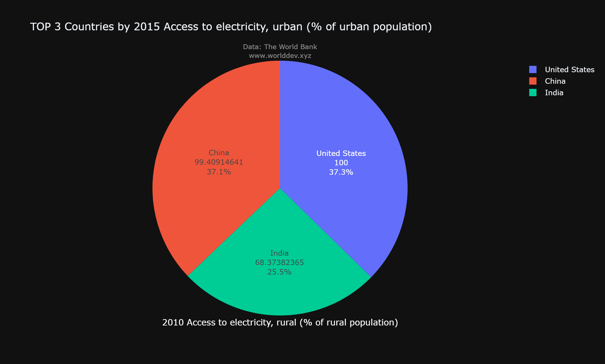
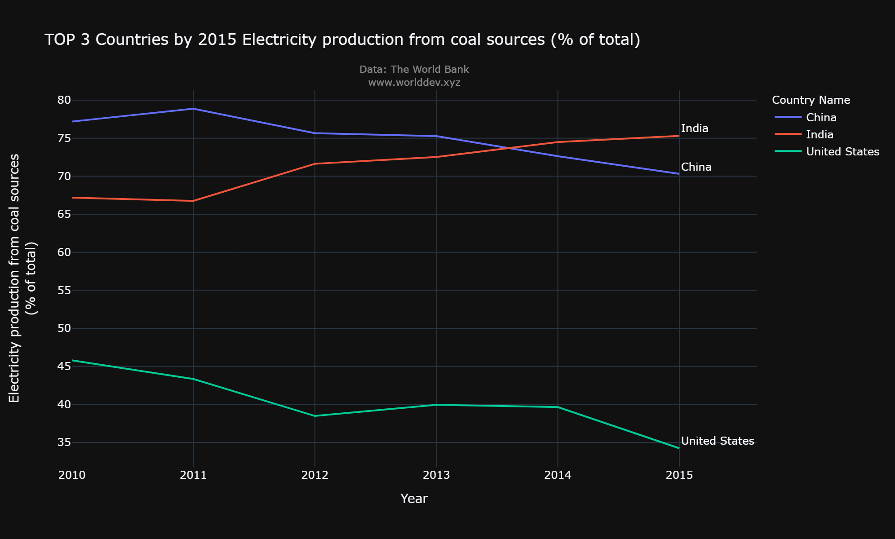
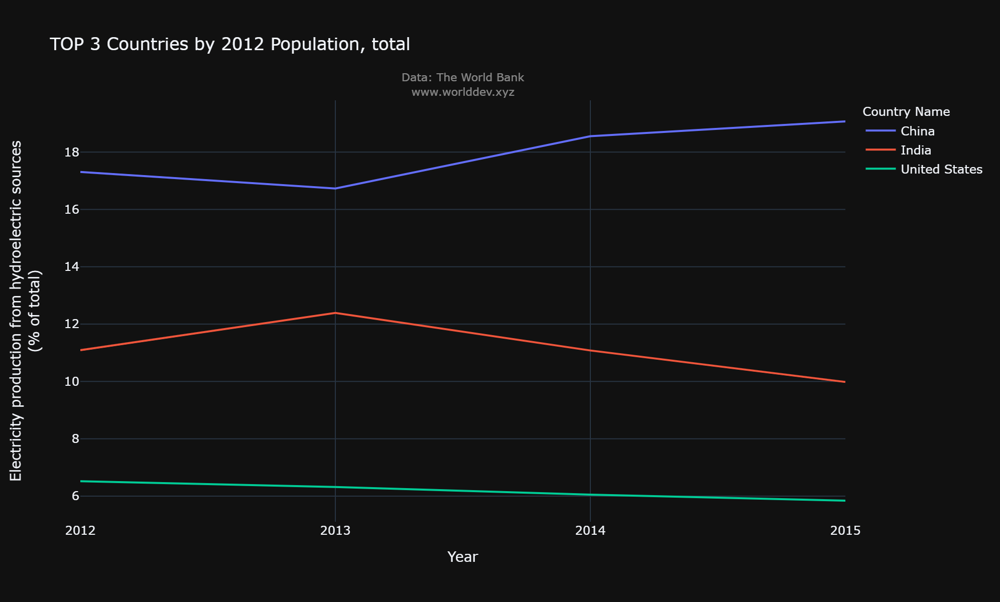
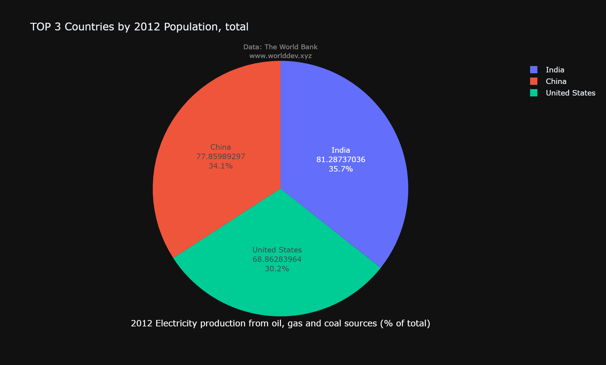
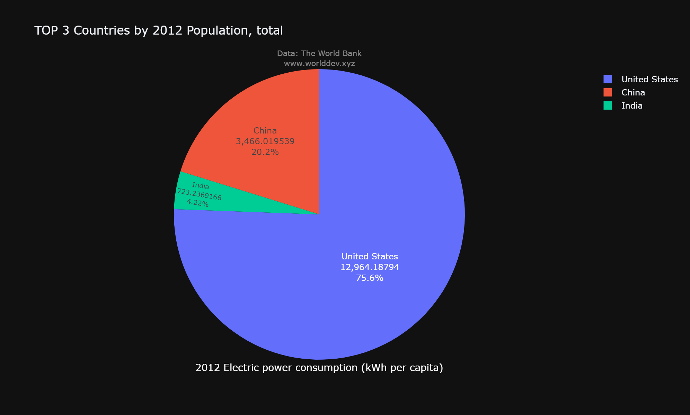
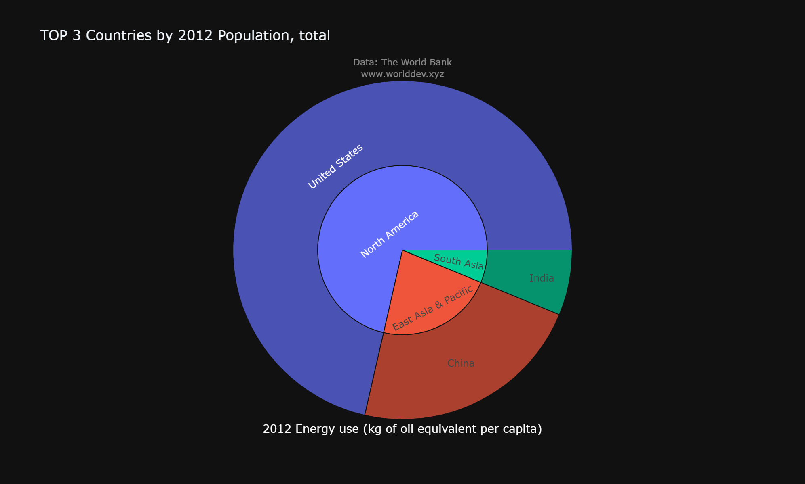
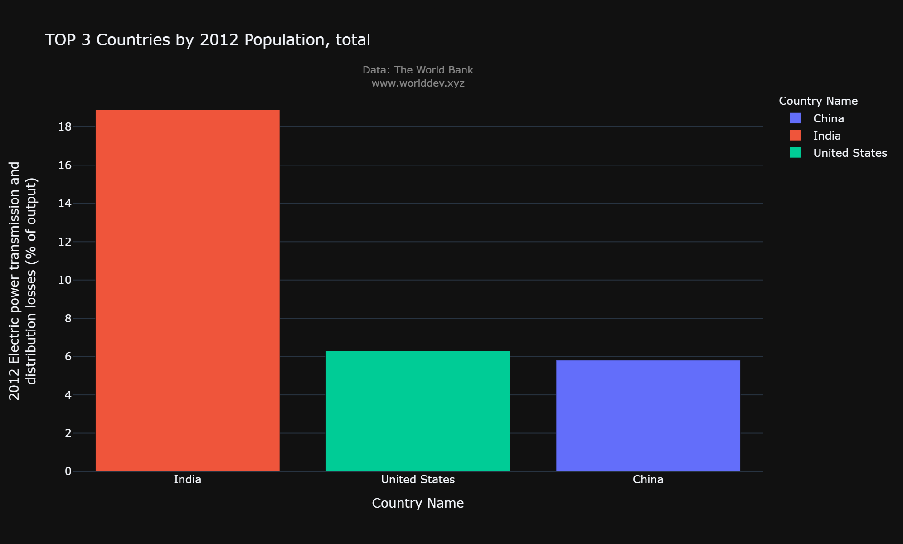

#  Access to Electricity
#### Around 13% of the world does not have access to electricity. For poverty reduction, economic growth, and standard of living improvements, electricity is essential. Measuring the percentage of people who have access to electricity is thus an important social and economic indicator. There is no universally accepted definition of what it means to have access to electricity. The majority of definitions, on the other hand, are focused on the provision of electricity, safe cooking facilities, and a required minimum level of consumption. 

#### The International Energy Agency's (IEA) definition encompasses more than just household delivery. It also requires households to meet a minimum level of electricity, which varies depending on whether the household is rural or urban and rises over time. This minimum threshold is 250 kilowatt-hours (kWh) per year for rural households and 500 kWh per year for urban households.
#### Method of approach - Analysis of data by graphs and approach 
#### Data Source - World Development Explorer

#### Topic :
#### Energy And Mining
#### Indicators :
*  Access to electricity rural

*  Access to electricity urban

*  Access  to electricity total

*  Electricity production from coal, gas and oil sources

*  Electricity production from Hydroelectric sources

*  Renewable electricity output

#### Analyzing Countries - United States of America, India, China

#### Time Plot: 2010 - 2018
#### Energy And Mining
#### Indicators:
#### Access to electricity rural
#### Access to electricity 
#### Analyzing Countries - United States of America, India, China

# Outlook

#### In this bar graph we can observe that the access of electricity for the three countries and out of three countries India has low access of electricity in rural areas. Although the population in India and China varies less compared with U.S.A but by observing the trend India is lacking in access of electricity more.

#### In this pie chart the access of electricity for urban regions of three countries and the trend is similar here.

#### This graph indicates the production of electricity from coal and out of three countries United States of America produces less over the time compared with India and China.

#### This graph indicates the production of electricity from hydroelectric resources and China produces more electricity from hydroelectric sources than India and United States of America

#### This pie chart shows the total production of electricity from all sources and India's production is high than China and United states of America.

#### In this pie chart we can see the consumption of electricity by all three countries and United States of America is consuming more electricity than India and China. Although production is high in India and china still United states providing more than India.

#### This pie chart indicates that United states of America uses more oil resources to produce electricty than India and China.

#### This bar graph shows the loss of distribution of electricity. This graph explains why India Although producing large amounts of electricity but still lacking in providing electricity to rural areas. The distribution loss of India is more than China and United states of America.
# Conclusion:
#### After analysing the graphs I observed there are many factors that are causing this problem. One of the factors from it us huge population, it costs more money to provide access electricity in all regions, As per the heat map the total electricity produces by coal, oil, gas, hydroelectric sources amd renewable electricity and total access of population is low in India as compared with U.S.A and china. The availability and affordability of electricity and clean cooking fuels are inversely proportional to income. Low income is strongly linked to poor energy access.Globally, access to electricity has increased, with the majority of this growth coming from low-to-middle-income countries. Access to electricity, on the other hand, is not equally distributed between rural and urban populations.
