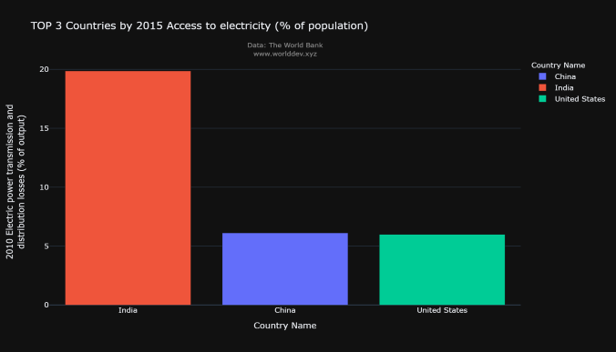

#  Access to Electricity
#### Around 13% of the world does not have access to electricity. For poverty reduction, economic growth, and standard of living improvements, electricity is essential. Measuring the percentage of people who have access to electricity is thus an important social and economic indicator. There is no universally accepted definition of what it means to have access to electricity. The majority of definitions, on the other hand, are focused on the provision of electricity, safe cooking facilities, and a required minimum level of consumption. 

#### The International Energy Agency's (IEA) definition encompasses more than just household delivery. It also requires households to meet a minimum level of electricity, which varies depending on whether the household is rural or urban and rises over time. This minimum threshold is 250 kilowatt-hours (kWh) per year for rural households and 500 kWh per year for urban households.
#### Method of approach - Analysis of data by graphs and approach 
#### Data Source - World Development Explorer
#### Topic:
#### Energy And Mining
#### Indicators:
#### Access to electricity rural
#### Access to electricity 
#### Analyzing Countries - United States of America, India, China

# Outlook

#### In this bar graph we can observe that the access of electricity for the three countries and out of three countries India has low access of electricity in rural areas. Although the population in India and China varies less compared with U.S.A but by observing the trend India is lacking in access of electricity more.

#### In this pie chart the access of electricity for urban regions of three countries and the trend is similar here.

#### This graph indicates the production of electricity from coal and out of three countries United States of America produces less over the time compared with India and China.

#### This graph indicates the corelation between the production of electricity from gas,coal and hydropower and the access of total population.

#### This corelation matrix heatmap indicates the relation of total electricity produced from all resources, total population and access of electricity in all regions.

